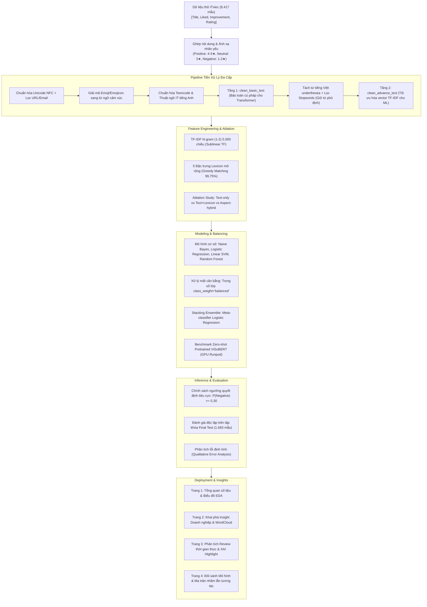

# 🏆 BÁO CÁO TỔNG KẾT TOÀN DIỆN ĐỒ ÁN NLP (FINAL PROJECT SUMMARY)
> **Môn học**: Xử lý Ngôn ngữ Tự nhiên (Natural Language Processing - NLP)  
> **Đề tài**: Phân tích Cảm xúc (Sentiment Analysis) Đánh giá Nhân viên Ngành CNTT trên ITviec  
> **Giảng viên hướng dẫn**: Thầy Đặng Văn Thìn  
> **Repository**: [https://github.com/mrkiss-it/NLP-Sentiment-Analysis-ITviec](https://github.com/mrkiss-it/NLP-Sentiment-Analysis-ITviec)  
> **Trạng thái hệ thống**: ✅ **55/55 Unit Tests Passed (100%)** | Ứng dụng Streamlit Dashboard hoàn thiện sẵn sàng Demo  

---

## 📌 I. THÔNG TIN CHUNG & ĐỘI NGŨ THỰC HIỆN

Dự án được xây dựng và hoàn thiện bởi nhóm 4 sinh viên theo mô hình chuyên môn hóa trách nhiệm độc lập:

| Thành viên | Vai trò & Trách nhiệm chính | Sản phẩm đầu ra bàn giao |
| :--- | :--- | :--- |
| **👑 Hoàng Hôn (TV1)** | **Trưởng nhóm / Tech Lead**<br>• Quản trị kiến trúc kỹ thuật & Quality Gatekeeper<br>• Xây dựng Pipeline tiền xử lý 2 tầng tiếng Việt & Negation Scope<br>• Giám sát kiểm thử tự động (**55/55 tests pass**) | Pipeline Tiền xử lý (`src/preprocessing.py`), Test Suite (`tests/`), Bộ từ điển chuẩn hóa (`data/dictionaries/`) |
| **📄 Văn Duy (TV2)** | **Data & Research Specialist**<br>• Khám phá dữ liệu chuyên sâu (EDA) & Trích xuất đặc trưng TF-IDF<br>• Thực hiện nghiên cứu đối chứng đặc trưng (Ablation Study)<br>• Chuyên trách biên soạn Báo cáo Đồ án toàn văn 6 Chương | Cuốn Báo cáo toàn văn Word/PDF, Báo cáo kỹ thuật EDA & Trích xuất đặc trưng (`reports/eda_feature_engineering.md`) |
| **🎨 Duy Khang (TV3)** | **Machine Learning Specialist**<br>• Huấn luyện, tối ưu 4 mô hình ML cơ sở & Stacking Ensemble<br>• Triển khai thử nghiệm Deep Learning ViSoBERT trên GPU Runpod<br>• Chuyên trách thiết kế Bộ Slide trình chiếu 15 trang Dark-tech | File Slide PowerPoint (`reports/slides/NLP_ITviec_Sentiment_Slides.pptx`), Artifacts mô hình (`models/`), Script sinh slide |
| **🎬 Phạm Thành Trung (TV4)** | **UI/UX & Deployment Specialist**<br>• Phát triển ứng dụng Web Streamlit 4 trang giao diện Dark-tech<br>• Tích hợp tính năng giải thích mô hình (XAI Highlight) & Threshold Policy<br>• Chuyên trách Kịch bản thuyết trình & Trực tiếp Demo trước Hội đồng | Web Dashboard (`app.py`, `app_pages/`), Kịch bản thuyết trình (`reports/slides/KICH_BAN_THUYET_TRINH_VA_DEMO.md`), Video Demo |

---

## 🎯 II. TỔNG QUAN BÀI TOÁN & THÁCH THỨC ĐẶC THÙ

### 1. Mục tiêu Đề tài
- Xây dựng hệ thống tự động phân loại cảm xúc đánh giá nhân sự CNTT thành 3 lớp: **Tích cực (Positive)**, **Trung tính (Neutral)**, **Tiêu cực (Negative)**.
- So sánh hiệu năng thực nghiệm giữa các thuật toán Machine Learning truyền thống (Naive Bayes, Logistic Regression, Linear SVM, Random Forest), mô hình kết hợp **Stacking Ensemble**, và mô hình Pretrained Transformer tiếng Việt (**ViSoBERT**).
- Khám phá các chủ đề/từ khóa then chốt tác động đến cảm xúc nhân sự (WordCloud) theo từng công ty công nghệ cụ thể.
- Triển khai ứng dụng Web tương tác thời gian thực phục vụ ứng viên và bộ phận Nhân sự (HR).

### 2. Dữ liệu & Chiến lược Gán nhãn yếu (Rating-derived Weak Labels)
- Dữ liệu thu thập gồm **8.417 đánh giá thực tế** từ 180 công ty công nghệ trên nền tảng **ITviec**.
- Mỗi review được ghép từ 3 trường nội dung:
  $$\text{Raw Text} = \text{Title} + \text{" . "} + \text{What I liked} + \text{" . "} + \text{Suggestions for improvement}$$
- Nhãn cảm xúc được ánh xạ từ số sao đánh giá tổng thể (`Rating` 1–5 sao):

| Số sao (`Rating`) | Nhãn Cảm xúc (`Sentiment`) | Số lượng mẫu | Tỷ lệ (%) | Ý nghĩa nghiệp vụ |
| :---: | :---: | :---: | :---: | :--- |
| ⭐⭐⭐⭐⭐ (5★) & ⭐⭐⭐⭐ (4★) | **Positive (Tích cực)** | **6.208** | **73,76%** | Hài lòng cao về chế độ, môi trường, văn hóa và đồng nghiệp |
| ⭐⭐⭐ (3★) | **Neutral (Trung tính)** | **1.639** | **19,47%** | Trạng thái trung hòa, review có cả điểm khen và chê cân bằng |
| ⭐⭐ (2★) & ⭐ (1★) | **Negative (Tiêu cực)** | **570** | **6,77%** | Thất vọng, bức xúc về OT, áp lực, chính sách đãi ngộ hoặc quản lý |

### 3. Bốn thách thức kỹ thuật lớn
1. **Mất cân bằng dữ liệu cực đoan (~11 : 1)**: Tỷ lệ Positive gấp gần 11 lần Negative, gây ra hiện tượng *"Bẫy Accuracy"* nếu mô hình chỉ học đoán nhãn đa số.
2. **Pha trộn ngôn ngữ & Teencode ngành IT**: Chêm xen thuật ngữ tiếng Anh (*OT, layoff, micromanage, benefit, fresher, probation, review lương...*) và teencode/từ viết tắt tiếng Việt (*cty, mn, k, lm, cx, vđ, dc...*).
3. **Cấu trúc đánh giá hai mặt (Mixed Sentiment)**: Review vừa khen môi trường, đồng nghiệp nhưng lại gay gắt chê lương thưởng và chế độ làm thêm giờ.
4. **Phủ định đảo chiều ngữ nghĩa (Negation)**: Các cấu trúc như *"không được thân thiện"*, *"ít cơ hội học hỏi"*, *"chẳng có định hướng"* nếu chỉ nhìn từ khóa đơn lẻ sẽ bị hiểu nhầm thành tích cực.

---

## 🏗️ III. KIẾN TRÚC HỆ THỐNG TOÀN DIỆN (END-TO-END PIPELINE)



---

## 🧪 IV. CHI TIẾT KỸ THUẬT NỔI BẬT

### 1. Tiền xử lý 2 tầng (Dual-tier Preprocessing)
- **Tầng 1 (`clean_basic_text`)**: Chuẩn hóa Unicode dựng sẵn NFC, xóa URL/email, chuyển đổi emoji/emojicon thành từ mang sắc thái tiếng Việt (`:)` $\to$ `tích_cực`, `😡` $\to$ `tiêu_cực`), chuẩn hóa teencode và từ lóng IT. Giữ nguyên dấu câu và trật tự từ tự nhiên để tokenizer BPE của mô hình Transformer (**ViSoBERT**) hoạt động tối ưu.
- **Tầng 2 (`clean_advance_text`)**: Thực hiện tách từ ghép tiếng Việt (`underthesea.word_tokenize`) và lọc bỏ từ dừng (stopwords).
- **Thuật toán nhận diện phạm vi phủ định (Negation Scope Detection)**: Khi bắt gặp từ phủ định (*không, chưa, chẳng, ít, thiếu...*), thuật toán mở cửa sổ từ tiếp theo để đảo ngược cực tính của từ cảm xúc đi liền sau (ví dụ: `không_thân_thiện` được gán sắc thái tiêu cực thay vì để từ `thân_thiện` kéo sang tích cực).
- **Từ điển Lexicon mở rộng (Greedy Matching)**: Đối sánh cụm từ dài nhất trước, đạt **độ bao phủ 99,75%** trên toàn bộ 8.417 review.

### 2. Phân chia tập dữ liệu & Thí nghiệm đối chứng đặc trưng (Ablation Study)
- **Quy trình phân chia chuẩn mực**:
  - Dữ liệu loại bỏ **4 dòng** sau bước audit trùng lặp (3 dòng trùng văn bản cùng nhãn giữ lại 1 đại diện, 1 nhóm trùng văn bản khác nhãn bị loại toàn bộ): 8.417 → **8.413 mẫu** đưa vào mô hình.
  - **Tập Development (80% = 6.730 mẫu)**: Dùng để trích xuất từ vựng, chạy 5-Fold Stratified Cross-Validation tinh chỉnh siêu tham số.
  - **Tập Final Test (20% = 1.683 mẫu)**: Hoàn toàn được khóa kín (blind hold-out), chỉ dùng để đánh giá kiểm chứng đúng 1 lần duy nhất cho mô hình đã hoàn thiện.

#### Bảng kết quả Thí nghiệm đối chứng (Ablation Study trên 5-Fold CV):
| Nhóm đặc trưng thử nghiệm | Số chiều | CV Macro F1 | Negative Recall | Nhận xét & Kết luận học thuật |
| :--- | :---: | :---: | :---: | :--- |
| **1. Text-only (TF-IDF N-gram 1-2)** | 5.000 | 0,5579 | 45,63% | Pipeline cơ sở chính thức cho ứng dụng chỉ nhận văn bản thô. |
| **2. Text + Lexicon** | 5.005 | **0,5664** | **48,03%** | **Cải thiện ổn định (+0,0084 F1, tốt hơn ở 4/5 fold)**, tăng độ nhạy nhận diện review tiêu cực thêm 2,40 điểm phần trăm. |
| **3. Text + Aspect Ratings** | 5.005 | 0,7369 | 69,52% | Tăng vọt điểm số nhưng tiềm ẩn nguy cơ rò rỉ thông tin. |
| **4. Full Hybrid (Text + Lex + Aspect)** | 5.010 | **0,7433** | **70,61%** | Tabular Upper-bound lý thuyết (không đưa vào demo text-only). |

> ⚠️ **Luận điểm khoa học về hiện tượng Data Shortcut**:  
> Điểm khía cạnh (Lương thưởng, Đào tạo, Quản lý, Môi trường, OT) có tương quan tuyến tính rất mạnh với điểm Rating tổng (nguồn gốc của weak label). Nếu đưa 5 điểm này vào làm feature, mô hình sẽ bị "lười biếng", chuyển thành bài toán học bảng (tabular learning) thay vì học cách thấu hiểu ngôn ngữ tự nhiên từ văn bản. Do đó, nhóm **kiên quyết duy trì mô hình text-only và text + lexicon** cho ứng dụng thực tế.

---

## 📊 V. KẾT QUẢ THỰC NGHIỆM & SO SÁNH MÔ HÌNH

### 1. So sánh các mô hình Machine Learning & Ensemble
Nhóm huấn luyện 4 thuật toán phân loại cơ sở kết hợp kỹ thuật `class_weight='balanced'` để chống mất cân bằng lớp, sau đó ghép nối thành mô hình **Stacking Ensemble Classifier**:
- **Tầng cơ sở (Base estimators)**: Multinomial Naive Bayes, Logistic Regression, Linear SVM (được Calibrated để xuất xác suất).
- **Tầng kết hợp (Meta-classifier)**: Logistic Regression học cách tối ưu trọng số kết hợp dự đoán từ 3 mô hình nền.

Việc **chọn mô hình được quyết định hoàn toàn bằng 5-Fold CV trên tập Development**; tập Final Test chỉ được mở đúng 1 lần cho mô hình đã khóa. Vì vậy chỉ Stacking Ensemble có số liệu Final Test — 4 mô hình cơ sở không được đánh giá trên tập này.

| Mô hình | Siêu tham số tốt nhất (GridSearchCV) | CV Macro F1 (Dev, 5-Fold) |
| :--- | :--- | :---: |
| Multinomial Naive Bayes | `alpha=0.1` | 0,4890 |
| Random Forest Classifier | `n_estimators=200`, `max_depth=20` | 0,5515 |
| Linear SVM (Calibrated) | `C=0.1`, `class_weight='balanced'` | 0,5561 |
| Logistic Regression (Balanced) | `C=1.0`, `penalty=l2`, `solver=lbfgs` | 0,5567 |
| **Stacking Ensemble (Mô hình chọn)** | Meta-classifier LR trên NB + LR + SVM | **0,5619** |

#### Kết quả Final Test của mô hình đã khóa (Stacking Ensemble, 1.683 mẫu):
| Chỉ số | Baseline (argmax) | Threshold 0,30 |
| :--- | :---: | :---: |
| Accuracy | 77,66% | 77,30% |
| Macro F1 | 0,5475 | **0,5507** |
| Negative Recall | 26,32% | **35,09%** |

### 2. Thử nghiệm Deep Learning Transformer: ViSoBERT
- **Hạ tầng thực nghiệm**: Chạy trên Cloud GPU Runpod (NVIDIA A40 / RTX 4090).
- **Chế độ**: Zero-shot Classification với Pretrained ViSoBERT tiếng Việt.
- **Kết quả**:
  - Accuracy: **65,36%** | Macro F1: **0,4036**
  - **Negative Recall đạt rất cao (75,44%)**: Bắt lỗi và nhận diện phàn nàn rất nhạy.
  - **Neutral Recall rất thấp (4,88%)**: Hầu hết các mẫu trung tính bị phân vân và đẩy sang Positive hoặc Negative.
- **Bài học kinh nghiệm (Key Takeaways)**:
  1. Tokenizer Byte-Pair Encoding (BPE) của ViSoBERT xung đột với bước tách từ ghép và lọc stopwords cổ điển (*Over-cleaning* làm mất ngữ cảnh ngữ pháp).
  2. Nếu không được fine-tune trực tiếp trên dữ liệu review ITviec, mô hình Transformer zero-shot không thể vượt qua mô hình Stacking ML đã được tối ưu đặc trưng chuyên sâu.

### 3. Giải mã hiện tượng "Bẫy Accuracy" (Accuracy Paradox)
- Nếu một mô hình thô thiển luôn luôn đoán toàn bộ là `Positive`, Accuracy của nó vẫn đạt tới **73,76%** vì lớp Positive chiếm đa số.
- Do đó, **Macro F1-Score** và **Negative Recall** mới là thước đo phản ánh trung thực năng lực phân loại của hệ thống trên dữ liệu thực tế.

---

## ⚙️ VI. TỐI ƯU HÓA QUYẾT ĐỊNH & PHÂN TÍCH LỖI (ERROR ANALYSIS)

### 1. Chính sách Ngưỡng Tiêu cực (Negative Threshold Policy 0,30)
Trong nghiệp vụ quản trị nhân sự, việc **bỏ sót một review tiêu cực (False Negative)** gây thiệt hại lớn hơn nhiều so với việc cảnh báo nhầm một review tích cực. Vì vậy, nhóm thiết lập chính sách hiệu chỉnh ngưỡng sau suy luận:
$$\text{Nếu } P(\text{Negative}) \ge 0,30 \implies \text{Dự đoán: Negative}$$

#### Bảng so sánh hiệu năng trên 1.683 mẫu Final Test:
| Tiêu chí đánh giá | Baseline (argmax mặc định) | Áp dụng Threshold 0,30 | Mức độ thay đổi |
| :--- | :---: | :---: | :---: |
| **Accuracy** | 77,66% | 77,30% | -0,36% (giảm không đáng kể) |
| **Macro F1-Score** | 0,5475 | **0,5507** | **+0,0032 (Cải thiện)** |
| **Negative Recall** | 26,32% (30/114 mẫu) | **35,09% (40/114 mẫu)** | **+8,77% (Bắt thêm 10 review xấu)** |
| **Negative Precision** | 53,57% | 44,44% | -9,13% (Đánh đổi do mở rộng ranh giới) |

### 2. Ma trận nhầm lẫn chi tiết (Confusion Matrix)

```text
    BASELINE (Argmax)                  POLICY THRESHOLD 0,30
  Dự đoán:  NEG   NEU   POS          Dự đoán:  NEG   NEU   POS
Thật NEG [  30    49    35 ]       Thật NEG [  40    40    34 ]  <- Cứu thêm 10 mẫu NEG
Thật NEU [  17   114   197 ]       Thật NEU [  31   100   197 ]
Thật POS [   9    69  1163 ]       Thật POS [  19    61  1161 ]
```

### 3. Phân tích định tính 5 nhóm lỗi điển hình (Qualitative Error Analysis)
1. **Review vừa khen vừa chê (Mixed Sentiment)**: Review mở đầu bằng nhiều lời khen môi trường/đồng nghiệp nhưng cuối bài chê gay gắt lương thưởng. Mô hình bị áp đảo bởi mật độ từ khóa tích cực ở phần đầu (Ví dụ: Nguồn `2668` FPT Software).
2. **Cấu trúc phủ định và đảo chiều ngữ nghĩa**: Cụm từ như *"không được trả tiền OT"* hoặc *"gần như không có cơ hội thăng tiến"* vẫn là bài toán thách thức với biểu diễn n-gram cố định.
3. **Nhiễu từ nhãn yếu (Weak Label Inconsistency)**: Review đánh giá 3 sao nhưng nội dung chê thậm tệ; khi mô hình đoán Negative là đúng về mặt ngữ nghĩa dù lệch nhãn rating (Ví dụ: Nguồn `8096`).
4. **Từ lóng và biến thể ngữ cảnh IT**: *"OT có trả tiền"* (tích cực) hoàn toàn khác biệt với *"OT không công / ép OT"* (tiêu cực).
5. **Review dài trải rộng nhiều khía cạnh**: Ép một bài viết dài đánh giá 5 khía cạnh vào 1 nhãn duy nhất làm mất sắc thái chi tiết.

---

## 💻 VII. ỨNG DỤNG TRIỂN KHAI: STREAMLIT WEB DASHBOARD

Ứng dụng được thiết kế theo phong cách Dark-tech hiện đại, thời gian phản hồi suy luận cực nhanh (< 50ms), gồm **4 phân hệ chính**:

1. **Trang 1: Tổng quan (Overview Dashboard)**:
   - Thống kê tổng quan 8.417 review, biểu đồ phân bố nhãn 3 lớp, độ dài văn bản và ma trận tương quan giữa các khía cạnh.
2. **Trang 2: Insight Doanh nghiệp (Company Analytics)**:
   - Phân tích cảm xúc theo từng công ty công nghệ (FPT Software, VNG, Shopee, KMS Technology, TMA Solutions...).
   - Trực quan hóa đám mây từ khóa (WordCloud) bóc tách các điểm nhân viên hài lòng nhất và các vấn đề bị phàn nàn nhiều nhất.
3. **Trang 3: Phân tích Review Thời gian thực & XAI**:
   - Khung nhập liệu đánh giá tự do cho phép người dùng kiểm thử trực tiếp.
   - **Explainable AI (XAI)**: Phân tích trọng số TF-IDF nổi bật, tô sáng từ ngữ mang sắc thái tích cực / tiêu cực giúp người dùng hiểu rõ lý do mô hình ra quyết định.
   - **Segmented Control**: Cho phép chuyển đổi tức thì giữa 2 mô hình đã khóa (`Stacking Ensemble` và `Text + Lexicon`).
4. **Trang 4: Mô hình & Đánh giá (Model Evaluation Lab)**:
   - Bảng tổng hợp số liệu thực nghiệm, biểu đồ ma trận nhầm lẫn tương tác, thanh trượt điều chỉnh ngưỡng Negative Threshold trực quan.

---

## 🚀 VIII. KẾT LUẬN, BÀI HỌC KINH NGHIỆM & HƯỚNG MỞ RỘNG

### 1. Đóng góp cốt lõi của Đồ án
- Xây dựng thành công quy trình NLP hoàn chỉnh từ khâu tiền xử lý dữ liệu thô, gán nhãn yếu, nghiên cứu đối chứng đến triển khai ứng dụng.
- Thuật toán **Negation Scope Detection** và bộ từ điển Lexicon tham lam giải quyết tốt cấu trúc phủ định tiếng Việt trong ngành IT.
- Minh chứng khoa học về việc loại trừ điểm khía cạnh để tránh rủi ro **Data Shortcut**, bảo đảm tính trung thực học thuật.
- Mô hình **Stacking Ensemble** kết hợp tối ưu giữa độ chính xác tổng thể (77,66%) và khả năng phân loại lớp mất cân bằng.
- Hệ thống đạt chuẩn kỹ thuật cao: **55/55 bài kiểm thử tự động pass 100%**.

### 2. Điểm hạn chế
- Chưa phân tách độc lập cảm xúc theo từng khía cạnh chi tiết (Aspect-Based Sentiment Analysis - ABSA).
- Mô hình ViSoBERT zero-shot chưa được fine-tune trực tiếp trên dữ liệu tên miền do hạn chế về tài nguyên tính toán GPU lâu dài.
- Nhãn huấn luyện vẫn dựa trên Rating sao nên còn chứa nhiễu từ phía người đánh giá.

### 3. Hướng phát triển tiếp theo
1. **Phát triển bài toán ABSA (Aspect-Based Sentiment Analysis)**: Tách riêng cảm xúc cho từng khía cạnh cụ thể (*Lương thưởng, Môi trường, Quản lý, Đào tạo, Cân bằng công việc*).
2. **Fine-tune PhoBERT / ViSoBERT**: Huấn luyện đầu cuối (End-to-End Fine-tuning) với kiến trúc bảo tồn nguyên vẹn ngữ pháp tiếng Việt.
3. **Tích hợp LLM Agent**: Ứng dụng mô hình ngôn ngữ lớn (Gemini / Llama 3) để tự động sinh báo cáo tổng hợp hành động (Actionable HR Recommendations) cho ban lãnh đạo công ty.

---

## 📂 IX. DANH MỤC LIÊN KẾT TÀI NGUYÊN BÀN GIAO (ARTIFACT DIRECTORY)

| Danh mục | Đường dẫn trong repo (tính từ thư mục gốc) | Mô tả nội dung |
| :--- | :--- | :--- |
| **Slide Thuyết trình** | `reports/slides/NLP_ITviec_Sentiment_Slides.pptx` | File trình chiếu 15 slide Dark-tech chuẩn hóa |
| **Kịch bản Thuyết trình** | `reports/slides/KICH_BAN_THUYET_TRINH_VA_DEMO.md` | Lời thoại chi tiết từng slide và kịch bản demo |
| **Ngân hàng Q&A** | `reports/slides/NGAN_HANG_CAU_HOI_PHAN_BIEN_NLP_VA_DEMO.md` | Bộ câu hỏi phản biện & câu trả lời mẫu cho Hội đồng |
| **Ứng dụng Streamlit** | `app.py` | Điểm khởi chạy Web Demo (`streamlit run app.py`) |
| **Pipeline Tiền xử lý** | `src/preprocessing.py` | Module làm sạch 2 tầng, Unicode, Teencode & Negation Scope |
| **Trích xuất đặc trưng** | `src/features.py` | Module TF-IDF N-gram, Lexicon & Ablation Study |
| **Mô hình hóa** | `src/models.py` | Huấn luyện Base Models & Stacking Ensemble Classifier |
| **Bộ kiểm thử tự động** | `tests/` | 55 unit tests bao phủ kiểm thử tiền xử lý, mô hình và UI |
| **Đề cương Báo cáo** | `reports/final_report_outline.md` | Đề cương 6 chương chuẩn quy cách báo cáo toàn văn |
