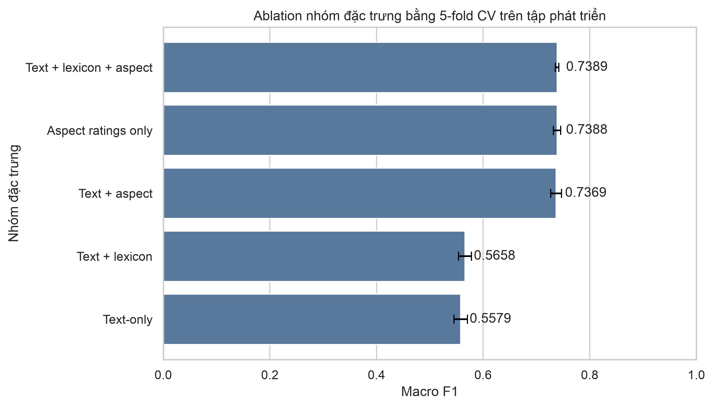

# Báo cáo TV2: Tổng quan dữ liệu, EDA và trích xuất đặc trưng

## 2.1. Tổng quan bộ dữ liệu ITviec Reviews

Bộ dữ liệu sau tiền xử lý tại `data/processed/reviews_cleaned.xlsx` gồm **8.417 review** và **23 trường**, không có dòng trùng hoàn toàn. Dữ liệu bao gồm:

- Thông tin định danh và doanh nghiệp: `id`, `Company Name`, `Cmt_day`.
- Nội dung review: `Title`, `What I liked`, `Suggestions for improvement`.
- Điểm tổng thể: `Rating` từ 1 đến 5 sao.
- Năm điểm khía cạnh: lương và phúc lợi, đào tạo, quản lý, văn hóa, văn phòng.
- Nội dung đã xử lý: `raw_review_text`, `clean_basic_text`, `clean_advance_text`.
- Đặc trưng từ điển: `pos_w`, `neg_w`, `pos_e`, `neg_e`, `total_we`, `sentiment_ratio`.
- Nhãn mục tiêu: `sentiment` gồm `Positive`, `Neutral`, `Negative`; đây là **rating-derived weak labels** được suy ra từ `Rating`, không phải nhãn vàng do con người đọc nội dung và gán.

Dữ liệu khuyết thiếu chỉ xuất hiện ở `What I liked` (1 dòng, 0,01%) và `Suggestions for improvement` (5 dòng, 0,06%). Các cột đã tiền xử lý và cột nhãn không có giá trị khuyết thiếu. Có 6 dòng thuộc ba nhóm `clean_advance_text` trùng; một nhóm có cùng text nhưng khác weak label. Trước khi chia dữ liệu modeling, nhóm bất đồng bị loại toàn bộ và nhóm trùng cùng nhãn chỉ giữ một dòng, còn **8.413 dòng**.

## 2.2. Phân tích khám phá dữ liệu

### Phân bố số sao và nhãn cảm xúc

| Rating | Số review |
|---:|---:|
| 1 | 124 |
| 2 | 446 |
| 3 | 1.639 |
| 4 | 2.698 |
| 5 | 3.510 |

| Nhãn | Số review | Tỷ lệ |
|---|---:|---:|
| Positive | 6.208 | 73,76% |
| Neutral | 1.639 | 19,47% |
| Negative | 570 | 6,77% |

Lớp Positive chiếm gần ba phần tư dữ liệu và lớn gấp khoảng 10,9 lần lớp Negative. Vì vậy, Accuracy không đủ để đánh giá mô hình; các thí nghiệm tiếp theo cần ưu tiên **Macro F1** và theo dõi Recall của lớp Negative.

### Độ dài nội dung review

| Trường | Trung bình | Trung vị | Phân vị 95 | Phân vị 99 | Lớn nhất |
|---|---:|---:|---:|---:|---:|
| What I liked | 50,29 | 36 | 131 | 237,36 | 1.400 |
| Suggestions for improvement | 29,97 | 20 | 78 | 184 | 876 |

Phân bố độ dài lệch phải rõ rệt: phần lớn review ngắn, nhưng có một số ngoại lệ rất dài. TF-IDF phù hợp với độ dài biến thiên này vì biểu diễn theo trọng số thay vì dùng số lần xuất hiện tuyệt đối.

### Quan hệ giữa điểm khía cạnh và cảm xúc tổng thể

Tương quan Spearman với `Rating`, theo thứ tự giảm dần:

| Khía cạnh | Tương quan Spearman |
|---|---:|
| Management cares about me | 0,7368 |
| Salary & benefits | 0,7343 |
| Culture & fun | 0,6566 |
| Training & learning | 0,6398 |
| Office & workspace | 0,5423 |

Điểm trung bình của mọi khía cạnh đều giảm theo thứ tự Positive → Neutral → Negative. Chênh lệch lớn nhất tập trung ở quản lý, lương/phúc lợi và văn hóa. Đây là các tín hiệu dự báo hữu ích, nhưng **không đưa `Rating` tổng thể vào ma trận đặc trưng** vì nhãn `sentiment` được tạo trực tiếp từ `Rating`; sử dụng trường này sẽ gây rò rỉ nhãn.

### Phân bố theo công ty và thời gian

Dữ liệu bao phủ **180 công ty** trong giai đoạn 07/2016–05/2025. Phân bố công ty không đồng đều: FPT Software có 2.014 review (23,93%), trong khi 110/180 công ty có dưới 20 review. Insight cấp công ty vì vậy phải hiển thị số mẫu và chỉ kết luận khi đạt ngưỡng tối thiểu.

### Chẩn đoán chất lượng weak label và lexicon

- Lexicon chỉ có ít nhất một hit trên **12,26%** review.
- `pos_e` và `neg_e` bằng 0 trên toàn bộ 8.417 dòng, nên emoji features hiện chưa hoạt động.
- `Recommend?` bất đồng với weak label ở nhiều mẫu: 41 Negative vẫn recommend; 411 Neutral và 87 Positive không recommend.
- Những dấu hiệu trên không chứng minh weak label sai, nhưng cho thấy Rating không thể được mô tả là ground truth tuyệt đối.

## 3.1. Phương pháp trích xuất đặc trưng

### TF-IDF

TF-IDF được fit trên `clean_advance_text` với cấu hình:

- `max_features=5000`;
- `ngram_range=(1, 2)`;
- `min_df=2`;
- `sublinear_tf=True`.

Sau xử lý text trùng, dữ liệu được chia phân tầng thành **development 80%** và **final test 20%** bằng `random_state=2026`. Final test được khóa và TV2 không tính bất kỳ metric mô hình nào trên tập này. Mọi lựa chọn feature chỉ dùng 5-fold Stratified CV trên development; vectorizer và scaler đều được fit lại bên trong từng fold.

Logistic Regression có `class_weight='balanced'` cho kết quả CV trên development:

| Cấu hình | Macro F1 trung bình | Độ lệch chuẩn |
|---|---:|---:|
| Unigram `(1, 1)` | 0,5396 | 0,0073 |
| Unigram + bigram `(1, 2)` | 0,5579 | 0,0127 |

Cấu hình unigram + bigram cao hơn 0,0183 Macro F1 và được chọn cho bộ đặc trưng text-only bàn giao.

### Ablation: mô hình học từ text hay điểm số?

| Nhóm feature | Macro F1 CV | Độ lệch chuẩn | Vai trò |
|---|---:|---:|---|
| Aspect ratings only | 0,7388 | 0,0069 | Diagnostic/tabular upper bound |
| Full structured hybrid | 0,7373 | 0,0101 | Diagnostic |
| Text-only | 0,5579 | 0,0127 | Pipeline NLP dùng cho Web Demo |
| Text + lexicon | 0,5556 | 0,0138 | Ablation; lexicon hiện không cải thiện |

Aspect-only cao hơn text-only cho thấy điểm khía cạnh là shortcut rất mạnh đối với weak label tạo từ Rating; riêng kết quả này không chứng minh mô hình hiểu ngôn ngữ.

### Ablation mở rộng: ghép điểm khía cạnh để cải thiện Neutral và Negative

Ablation ở trên chỉ báo Macro F1 nên chưa trả lời được câu hỏi nhóm quan tâm: điểm khía cạnh có giúp tách lớp Neutral và kéo Recall lớp Negative lên không. Thí nghiệm bổ sung (`scripts/run_aspect_hybrid_ablation.py`) dùng lại đúng giao thức — 5-fold Stratified CV trên development, `random_state=2026`, TF-IDF `(1, 2)` 5.000 chiều, `MinMaxScaler` và vectorizer fit lại trong từng fold, Logistic Regression `class_weight='balanced'` — và báo cáo thêm chỉ số từng lớp.

| Nhóm feature | Macro F1 | Neutral F1 | Recall Negative | Negative F1 | Accuracy |
|---|---:|---:|---:|---:|---:|
| Text-only | 0,5579 | 0,4456 | 0,4563 | 0,3894 | 0,7158 |
| **Text + aspect** | **0,7369** | **0,6441** | **0,6952** | **0,6485** | **0,8373** |
| Text + lexicon + aspect | 0,7373 | 0,6439 | 0,7017 | 0,6498 | 0,8373 |
| Aspect ratings only | 0,7388 | 0,6353 | 0,7676 | 0,6649 | 0,8337 |

Baseline text-only tái lập đúng 0,5579 Macro F1 như bảng trên, xác nhận hai thí nghiệm so sánh được với nhau.

Ghép năm điểm khía cạnh vào vector TF-IDF cải thiện rõ rệt đúng hai điểm yếu đã nêu:

- **Neutral F1: 0,4456 → 0,6441** (+0,1985).
- **Recall Negative: 0,4563 → 0,6952** (+0,2389).
- Macro F1: 0,5579 → 0,7369 (+0,1790).

Thêm nhóm lexicon lên trên aspect gần như không đổi (+0,0004 Macro F1), nên cấu hình bàn giao chọn **text + aspect** cho gọn. Đáng chú ý, `Aspect ratings only` có Macro F1 và Recall Negative cao nhất nhưng **Neutral F1 thấp hơn** text + aspect (0,6353 so với 0,6441): phần văn bản vẫn đóng góp riêng cho việc tách lớp Neutral, tức là hybrid không phải chỉ đơn thuần đọc lại điểm số.

Năm cột khía cạnh không có giá trị thiếu (0,00% trên cả năm cột), nên bước `fillna(0.0)` trong `FeatureExtractor._prepare_numeric` không kích hoạt và không tạo giá trị 0 giả nằm ngoài thang 1-5.

**Giới hạn phải ghi trong báo cáo khi trình bày bảng này.** Nhãn `sentiment` được suy ra từ `Rating`, và điểm khía cạnh tương quan Spearman 0,5423-0,7368 với `Rating`. Vì vậy phần lớn mức tăng đến từ việc mô hình khôi phục lại thang điểm đã sinh ra nhãn, chứ không phải từ việc hiểu văn bản tốt hơn. Ngoài ra artifact hybrid cần đủ năm điểm khía cạnh lúc dự đoán, trong khi Web Demo chỉ nhận văn bản tự do. Kết luận vận hành: **hybrid dùng cho phần thực nghiệm và bảng so sánh mô hình; Web Demo giữ artifact text-only.** Hai artifact dùng chung split và seed nên số liệu đặt cạnh nhau được.

Ma trận text-only cuối cùng:

- `X_train` (development): 6.730 × 5.000.
- `X_test` (final test khóa): 1.683 × 5.000.
- Nhãn development: 4.964 Positive, 1.310 Neutral, 456 Negative.
- TV2 không báo cáo phân phối chi tiết hoặc metric mô hình trên final test ngoài việc kiểm tra contract kỹ thuật.

### Xử lý mất cân bằng

Hai chiến lược được bàn giao để TV3 đánh giá chéo:

1. Dùng `class_weight='balanced'` trong các mô hình hỗ trợ trọng số lớp.
2. Áp dụng SMOTE **bên trong từng fold development**. Minh họa tạo 4.964 mẫu cho mỗi lớp, tổng cộng 14.892 mẫu; final test không được resample.

Do dữ liệu TF-IDF có số chiều cao, SMOTE có thể tạo các vector tổng hợp khó diễn giải. Kết luận chọn chiến lược phải dựa trên Macro F1, Recall lớp Negative và ma trận nhầm lẫn, không chỉ dựa trên Accuracy.

## Tệp bàn giao

- `notebooks/01_data_exploration_eda.ipynb`: notebook EDA và feature engineering đã chạy từ đầu đến cuối.
- `src/features.py`: pipeline text/structured rõ ràng, xử lý text trùng, chia phân tầng, SMOTE và artifact contract.
- `models/text_tfidf_vectorizer.joblib`: vectorizer text-only.
- `models/text_feature_extractor.joblib`: extractor text-only đã fit trên development.
- `models/train_test_features.joblib`: ma trận development/final-test, nhãn, indices, feature names và metadata.
- `models/artifact_manifest.json`: runtime versions, dataset hash, Git SHA và checksum artifact.
- `requirements.lock`: môi trường Python 3.11 tái lập được để đọc artifact.
- `scripts/run_aspect_hybrid_ablation.py`: ablation text/aspect kèm chỉ số từng lớp; xuất `reports/aspect_hybrid_ablation.csv`.
- `scripts/build_hybrid_artifacts.py`: dựng artifact hybrid, không đụng tới artifact text-only.
- `models/hybrid_feature_extractor.joblib`: extractor TF-IDF + 5 điểm khía cạnh đã fit trên development (dùng `transform_hybrid`).
- `models/hybrid_train_test_features.joblib`: ma trận 6.730 × 5.005 và 1.683 × 5.005, cùng split/seed với bản text-only.
- `models/hybrid_artifact_manifest.json`: feature contract của bản hybrid, kèm ràng buộc dữ liệu lúc inference.
- `data/annotation/sentiment_audit_blind.csv` và `sentiment_audit_key.csv`: bộ 300 review cho hai người gán nhãn thủ công độc lập.
- `reports/overview_for_team.md`: giải thích pipeline bằng ngôn ngữ đơn giản.
- `reports/figures/`: chín biểu đồ EDA/feature diagnostics độ phân giải 300 dpi.
