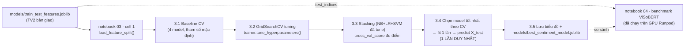

# Giải thích chi tiết code Phase03 (Modeling & Hyperparameter Tuning — TV3)

Tài liệu này giải thích từng đoạn code đã triển khai cho Phase03, gồm 3 phần:

1. `src/models.py` — thư viện logic dùng chung (class `SentimentModelTrainer`).
2. `notebooks/03_sentiment_modeling_ml.ipynb` — notebook chính, **đã chạy thật** trên artifact của TV2.
3. `notebooks/04_sentiment_modeling_deeplearning.ipynb` — benchmark ViSoBERT, **đã chạy thật trên GPU (Runpod)**, có số liệu thật.

Mục tiêu của tài liệu: giúp người đọc (kể cả không viết ra đoạn code này) hiểu **code làm gì** và quan trọng hơn là **tại sao lại viết như vậy**, đặc biệt ở những chỗ không hiển nhiên.

---

## 0. Sơ đồ luồng dữ liệu tổng thể



Nguyên tắc xuyên suốt: **`X_test` (final test đã khóa) chỉ được `.predict()` đúng một lần**, ở bước 3.4, sau khi model đã được chọn xong hoàn toàn dựa trên cross-validation trên `X_train`. Mọi so sánh/tuning ở các bước trước đó đều chỉ dùng `X_train`. Đây là kỷ luật chống rò rỉ dữ liệu mà TV2 đã thiết lập từ trước (thấy rõ trong dòng in `"Final test chỉ được dùng sau khi đã chọn xong mô hình bằng CV trên train."`), và Phase03 giữ nguyên kỷ luật này.

---

## 1. `src/models.py`

### 1.1. Import và hằng số `PARAM_GRIDS`

```python
import os
import joblib
import pandas as pd
import numpy as np
import matplotlib.pyplot as plt
import seaborn as sns
from typing import Dict, Any, List, Optional
from sklearn.base import clone
from sklearn.naive_bayes import MultinomialNB
from sklearn.linear_model import LogisticRegression
from sklearn.svm import SVC
from sklearn.ensemble import RandomForestClassifier, StackingClassifier
from sklearn.metrics import classification_report, confusion_matrix, accuracy_score, f1_score
from sklearn.model_selection import cross_val_score, GridSearchCV, StratifiedKFold


PARAM_GRIDS: Dict[str, Any] = {
    "Multinomial Naive Bayes": {
        "alpha": [0.01, 0.1, 0.5, 1.0, 2.0],
    },
    "Logistic Regression": [
        {"solver": ["lbfgs"], "penalty": ["l2"], "C": [0.1, 1.0, 5.0, 10.0]},
        {"solver": ["saga"], "penalty": ["l1", "l2"], "C": [0.1, 1.0, 5.0, 10.0]},
    ],
    "Support Vector Machine (Linear)": {
        "C": [0.1, 0.5, 1.0, 2.0, 5.0],
    },
    "Random Forest": {
        "n_estimators": [100, 200],
        "max_depth": [10, 20, None],
    },
}
```

`PARAM_GRIDS` là "thực đơn" tham số mà `GridSearchCV` sẽ thử **tất cả tổ hợp** (grid search = duyệt lưới đầy đủ, khác với `RandomizedSearchCV` chỉ lấy mẫu ngẫu nhiên). Các giá trị đúng theo đặc tả kế hoạch TV3 (Ngày 2 — Hyperparameter Tuning), không tự ý thêm/bớt.

Điểm cần chú ý kỹ nhất: **`"Logistic Regression"` là một `list` gồm 2 `dict`, không phải 1 `dict` duy nhất**. `GridSearchCV` hỗ trợ cú pháp này để biểu diễn "thử lần lượt từng nhóm tổ hợp con" thay vì "thử tích Descartes của mọi giá trị mọi tham số".

Lý do phải tách làm 2 nhánh: về mặt toán học, solver `lbfgs` (Limited-memory BFGS — một phương pháp tối ưu bậc 2 xấp xỉ) chỉ giải được bài toán có hàm phạt khả vi trơn, tức chỉ hỗ trợ `penalty='l2'` (hoặc không phạt). Nó **không** hỗ trợ `penalty='l1'` (Lasso, dùng norm-1 không khả vi tại 0). Ngược lại, solver `saga` (một biến thể stochastic gradient descent) hỗ trợ cả `l1` và `l2`. Nếu viết gộp thành 1 dict:

```python
{"solver": ["lbfgs", "saga"], "penalty": ["l1", "l2"], "C": [...]}
```

sklearn sẽ sinh ra **tích Descartes** của mọi giá trị, bao gồm cả tổ hợp không hợp lệ `lbfgs + l1`. Khi gặp tổ hợp này, `LogisticRegression.fit()` sẽ raise lỗi tham số nội bộ; `GridSearchCV` (tùy phiên bản) có thể bắt lỗi và gán điểm `NaN` cho tổ hợp đó thay vì crash toàn bộ, nhưng vẫn:
- lãng phí thời gian chạy (fit rồi mới biết lỗi),
- in ra rất nhiều warning gây nhiễu log,
- và về nguyên tắc là "thử một cấu hình biết chắc sẽ không dùng được".

Tách thành 2 dict trong 1 list đảm bảo **mọi tổ hợp được thử đều hợp lệ về mặt toán học**, không lãng phí compute.

### 1.2. `__init__` — khởi tạo 4 model baseline

```python
class SentimentModelTrainer:
    def __init__(self):
        self.models: Dict[str, Any] = {
            "Multinomial Naive Bayes": MultinomialNB(),
            "Logistic Regression": LogisticRegression(max_iter=1000, class_weight='balanced', random_state=42),
            "Support Vector Machine (Linear)": SVC(kernel='linear', class_weight='balanced', probability=True, random_state=42),
            "Random Forest": RandomForestClassifier(n_estimators=100, class_weight='balanced', random_state=42)
        }
        self.trained_models = {}
        self.evaluation_results = []
        self.best_params: Dict[str, Dict[str, Any]] = {}
        self.tuning_results: List[Dict[str, Any]] = []
```

`self.models` là dict tên → model **chưa fit**, dùng tham số mặc định (ngoại trừ `class_weight='balanced'` được set cứng ngay từ đầu, vì đây là quyết định thiết kế áp dụng cho mọi thí nghiệm, không phải tham số cần tune).

`class_weight='balanced'` là cơ chế chuẩn của scikit-learn để xử lý mất cân bằng lớp: nó tự tính trọng số nghịch đảo tần suất theo công thức `n_samples / (n_classes * n_samples_of_class)`, rồi nhân trọng số này vào hàm mất mát trong lúc huấn luyện. Vì Positive chiếm 73,76% còn Negative chỉ 6,77%, nếu không có cơ chế này, mô hình có xu hướng "lười" đoán mọi thứ là Positive vì vẫn đạt Accuracy cao (mất cân bằng che giấu chất lượng thật). Naive Bayes không nhận tham số này vì công thức xác suất hậu nghiệm Bayes của nó không có chỗ để chèn trọng số kiểu này.

`Support Vector Machine (Linear)` là `SVC(kernel='linear', ...)` chứ không phải `LinearSVC` — cách đặt tên trong lớp này khớp với yêu cầu của kế hoạch (`SVC(kernel='linear', C=1.0, class_weight='balanced', probability=True)`); lý do cần `probability=True` sẽ giải thích ở phần Stacking bên dưới.

4 thuộc tính state phía dưới (`trained_models`, `evaluation_results`, `best_params`, `tuning_results`) đóng vai trò "bộ nhớ" của object — notebook sẽ gọi nhiều hàm khác nhau trên cùng 1 instance `trainer`, và các hàm ghi/đọc lại các thuộc tính này để truyền dữ liệu cho nhau (ví dụ `tune_hyperparameters()` ghi vào `self.trained_models`, rồi `get_stacking_model()` đọc lại đúng dict đó).

### 1.3. `get_stacking_model()` — dựng mô hình Stacking Ensemble

```python
def get_stacking_model(self, base_estimators: Optional[Dict[str, Any]] = None, cv: int = 5):
    base_estimators = base_estimators or {}
    nb = base_estimators.get("Multinomial Naive Bayes", MultinomialNB())
    lr = base_estimators.get(
        "Logistic Regression",
        LogisticRegression(max_iter=1000, class_weight='balanced', random_state=42),
    )
    svm = base_estimators.get(
        "Support Vector Machine (Linear)",
        SVC(kernel='linear', probability=True, class_weight='balanced', random_state=42),
    )
    estimators = [
        ('nb', clone(nb)),
        ('lr', clone(lr)),
        ('svm', clone(svm)),
    ]
    stack_model = StackingClassifier(
        estimators=estimators,
        final_estimator=LogisticRegression(max_iter=1000),
        cv=cv
    )
    return stack_model
```

**Cơ chế Stacking Ensemble** (để hiểu code này cần hiểu thuật toán trước): Stacking là kỹ thuật kết hợp nhiều model "cấp 1" (base estimators) bằng cách dùng **dự đoán của chúng làm đặc trưng đầu vào** cho một model "cấp 2" (meta-classifier / `final_estimator`). Cụ thể:

1. Với mỗi mẫu train, 3 model con (NB, LR, SVM) được huấn luyện theo kiểu cross-fitting nội bộ (tham số `cv` truyền vào `StackingClassifier`) để sinh ra dự đoán xác suất "out-of-fold" (mỗi model chỉ dự đoán trên fold nó chưa được huấn luyện, giống ý tưởng cross-validation, để tránh model "nhìn thấy trước" nhãn của chính mẫu nó đang dự đoán).
2. Xác suất của 3 model (mỗi model 3 lớp → 9 cột đặc trưng mới) được ghép lại thành ma trận đặc trưng mới.
3. `final_estimator` (ở đây là một `LogisticRegression` khác) học cách kết hợp tối ưu 9 cột đó thành nhãn cuối cùng — về bản chất nó học "nên tin model nào hơn trong tình huống nào".

Vì bước 1 cần **xác suất** (không chỉ nhãn cứng) từ mỗi model con, SVM bắt buộc phải bật `probability=True` (SVM gốc chỉ cho ra khoảng cách đến siêu phẳng, không phải xác suất; `probability=True` bật thêm cơ chế Platt scaling để chuyển khoảng cách đó thành xác suất).

**Vì sao hàm nhận tham số `base_estimators` (dict, optional)?** Đây là điểm thiết kế quan trọng nhất của hàm này. Nếu gọi `get_stacking_model()` không truyền gì, nó tự tạo 3 model con với tham số **mặc định** (dùng để test nhanh, hoặc dùng làm fallback). Nhưng trong notebook thật, ta luôn gọi:

```python
trainer.get_stacking_model(base_estimators=trainer.trained_models, cv=...)
```

— tức truyền vào đúng dict các model **đã được `GridSearchCV` tune ở bước trước**. Nhờ vậy Stacking không lãng phí: nó dùng lại đúng cấu hình siêu tham số tốt nhất đã tìm ra cho từng model con (ví dụ NB dùng `alpha=0.1`, SVM dùng `C=0.1`), đúng theo yêu cầu kế hoạch "kết hợp 3 mô hình cơ sở **tốt nhất**", chứ không phải 3 model cấu hình ngẫu nhiên mặc định.

`clone(nb)`, `clone(lr)`, `clone(svm)`: `sklearn.base.clone` tạo ra một bản sao **chưa fit** của model, giữ nguyên tham số nhưng xóa trạng thái đã học (`coef_`, `class_log_prior_`, v.v.). Bắt buộc phải clone vì nếu truyền thẳng object `nb`/`lr`/`svm` (vốn đã fit trong bước `tune_hyperparameters`) vào `StackingClassifier`, `StackingClassifier.fit()` sẽ cố fit lại chúng — có thể hoạt động sai hoặc gây side-effect vì cùng 1 object Python được 2 chỗ trong code cùng tham chiếu tới (nếu `StackingClassifier` fit lại nó, `trainer.trained_models[...]` cũng bị ảnh hưởng theo, gây khó debug).

Tham số `cv` của hàm này (mặc định 5) là số fold cross-fitting **nội bộ** của `StackingClassifier` — khác hoàn toàn với CV ở "lớp ngoài" dùng để đo điểm tổng quát hóa của cả cụm Stacking (sẽ nói rõ ở mục 2.3 khi phân tích notebook). Việc để `cv` là tham số có thể truyền vào (thay vì hard-code `cv=5` như bản gốc trước khi sửa) cho phép notebook linh hoạt hạ xuống `cv=3` khi cần đo điểm nhanh, và dùng lại `cv=5` chuẩn khi build model final để lưu.

### 1.4. `tune_hyperparameters()` — phần lõi phức tạp nhất

```python
def tune_hyperparameters(
    self, X_train, y_train, cv: int = 5, scoring: str = 'f1_macro',
    random_state: int = 2026, n_jobs: int = -1,
    param_grids: Optional[Dict[str, Any]] = None,
) -> pd.DataFrame:
    grids = param_grids or PARAM_GRIDS
    splitter = StratifiedKFold(n_splits=cv, shuffle=True, random_state=random_state)
    self.tuning_results = []
    tuned_models: Dict[str, Any] = {}

    for name, base_model in self.models.items():
        search_model = base_model
        if name == "Support Vector Machine (Linear)":
            search_model = SVC(kernel='linear', class_weight='balanced', probability=False, random_state=42)

        search = GridSearchCV(
            estimator=search_model,
            param_grid=grids[name],
            cv=splitter,
            scoring=scoring,
            n_jobs=n_jobs,
            refit=True,
        )
        print(f"-> Tuning {name}...")
        search.fit(X_train, y_train)

        best_estimator = search.best_estimator_
        if name == "Support Vector Machine (Linear)":
            best_estimator = SVC(
                kernel='linear', class_weight='balanced', probability=True,
                random_state=42, **search.best_params_,
            )
            best_estimator.fit(X_train, y_train)

        tuned_models[name] = best_estimator
        self.best_params[name] = search.best_params_
        self.tuning_results.append({
            "Model": name,
            "Best Params": search.best_params_,
            "CV Macro F1 Mean": search.best_score_,
        })

    self.trained_models.update(tuned_models)
    results_df = pd.DataFrame(self.tuning_results).sort_values(
        "CV Macro F1 Mean", ascending=False
    )
    return results_df
```

**Bước 1 — `StratifiedKFold`:** khác với `KFold` thường (chia ngẫu nhiên đơn thuần), `StratifiedKFold` đảm bảo **mỗi fold giữ đúng tỷ lệ 3 lớp** như dữ liệu gốc. Điều này đặc biệt quan trọng ở đây vì Negative chỉ chiếm 6,77% (khoảng 456/6730 mẫu train) — nếu dùng `KFold` thường, có xác suất một fold ngẫu nhiên gần như không có mẫu Negative nào, khiến điểm CV của fold đó vô nghĩa (không thể tính Recall/F1 cho lớp gần như trống). `shuffle=True, random_state=random_state` đảm bảo việc chia là ngẫu nhiên nhưng **tái lập được** — chạy lại nhiều lần sẽ ra đúng cùng 1 cách chia, giúp so sánh công bằng giữa các model (baseline dùng cùng seed `2026` cho `cv_5fold` ở notebook, tuning ở đây dùng `random_state` mặc định cũng là `2026`).

**Bước 2 — vòng lặp `for name, base_model in self.models.items()`:** chạy `GridSearchCV` **riêng biệt** cho từng model trong 4 model (không gộp chung thành 1 pipeline lớn), vì mỗi model có lưới tham số hoàn toàn khác nhau (`PARAM_GRIDS[name]`).

**Bước 3 — xử lý đặc biệt cho SVM (`probability=False` lúc tìm kiếm):** đây là chỗ cần giải thích kỹ nhất trong toàn bộ file. `SVC(probability=True)` không chỉ đơn giản là "bật thêm 1 cờ" — về bên trong, mỗi lần gọi `.fit()`, nó tự động chạy thêm **5-fold cross-validation nội bộ** (Platt scaling: huấn luyện SVM trên 4/5 dữ liệu, dự đoán trên 1/5 còn lại, lặp lại 5 lần, rồi fit một Logistic Regression phụ lên các dự đoán đó để hiệu chỉnh xác suất). Nếu bật `probability=True` ngay trong lúc `GridSearchCV` đang chạy — bản thân `GridSearchCV` cũng đã tự chia CV ở "lớp ngoài" (ở đây là 5 fold, từ `splitter`) — thì với mỗi 1 trong 5 giá trị `C` cần thử, mỗi 1 trong 5 fold ngoài, model lại phải chạy thêm 5 fold *bên trong* để hiệu chỉnh xác suất. Tổng số lần fit SVM thực tế sẽ là:

```
5 (giá trị C) × 5 (fold ngoài của GridSearchCV) × 5 (fold trong của Platt scaling) = 125 lần fit
```

thay vì chỉ `5 × 5 = 25` lần nếu tắt `probability`. Việc hiệu chỉnh xác suất này **hoàn toàn không ảnh hưởng** đến việc chọn `C` nào tốt nhất (chọn `C` chỉ cần độ chính xác phân loại nhãn, đo bằng `scoring='f1_macro'` trên nhãn dự đoán cứng, không cần xác suất) — nên bật nó lên trong lúc tìm kiếm là lãng phí compute thuần túy, có thể khiến notebook chạy lâu hơn nhiều lần mà không đổi kết quả.

Giải pháp: tìm `C` tốt nhất với `probability=False` (nhanh), sau khi có `search.best_params_`, khởi tạo **lại** một `SVC` mới với đúng `C` đó nhưng `probability=True`, rồi `.fit()` nó **đúng 1 lần** trên toàn bộ `X_train`. Đây chính là lý do khối `if name == "Support Vector Machine (Linear)":` xuất hiện 2 lần trong hàm này (một lần trước khi search, một lần sau khi có kết quả).

**Bước 4 — `refit=True`:** đây là tham số mặc định của `GridSearchCV` nhưng viết tường minh để rõ ý đồ. Khi `refit=True`, sau khi tìm ra tổ hợp tham số tốt nhất, `GridSearchCV` tự động fit lại 1 model với tổ hợp đó trên **toàn bộ** `X_train` (không chỉ trên các fold) — kết quả này chính là `search.best_estimator_`. Nhờ vậy với 3 model không phải SVM, ta có thể dùng thẳng `search.best_estimator_` mà không cần fit thủ công thêm lần nào.

**Bước 5 — gom kết quả:** mỗi model sau khi tune được lưu vào `tuned_models[name]`, `self.best_params[name]` lưu lại tổ hợp tham số tốt nhất (để tra cứu/log), và `self.tuning_results` gom thành list dict để cuối cùng dựng thành `pd.DataFrame`, sắp xếp giảm dần theo `CV Macro F1 Mean` — nhờ vậy notebook chỉ cần `display(tuning_results...)` là có ngay bảng so sánh đã sắp hạng.

`self.trained_models.update(tuned_models)`: cập nhật (không ghi đè hoàn toàn) dict `trained_models` — dùng `.update()` thay vì gán lại `=` để nếu sau này có thêm model khác được thêm vào `trained_models` từ nơi khác (ví dụ `train_and_evaluate_all`), chúng không bị xóa mất.

### 1.5. `plot_model_comparison()` — vẽ bar chart so sánh

```python
def plot_model_comparison(self, results_df, score_col="CV Macro F1 Mean", save_path=None):
    ordered = results_df.sort_values(score_col, ascending=False)
    plt.figure(figsize=(8, 5))
    sns.barplot(data=ordered, x=score_col, y="Model", hue="Model", palette="viridis", legend=False)
    plt.title("So sánh hiệu năng các mô hình")
    plt.xlabel(score_col)
    plt.ylabel("")
    plt.tight_layout()
    if save_path:
        os.makedirs(os.path.dirname(save_path), exist_ok=True)
        plt.savefig(save_path, dpi=300)
        print(f"Đã lưu biểu đồ so sánh tại: {save_path}")
    plt.show()
```

Hàm thuần túy để trực quan hóa: vẽ bar chart ngang (`x=score_col, y="Model"`), model có điểm cao nhất nằm trên cùng nhờ `sort_values(..., ascending=False)`. `hue="Model", legend=False` là cách viết cần thiết ở seaborn bản mới để mỗi thanh bar có màu riêng theo `palette` mà không hiện chú giải thừa (vì trục y đã là tên model rồi). `os.makedirs(..., exist_ok=True)` đảm bảo thư mục `reports/figures/` tồn tại trước khi `savefig` — tránh lỗi nếu thư mục chưa được tạo.

### 1.6. Các hàm giữ nguyên từ trước: `train_and_evaluate_all`, `plot_confusion_matrix`, `save_model`

Ba hàm này đã có sẵn trong `src/models.py` trước khi Phase03 bắt đầu, không bị sửa logic:

- `train_and_evaluate_all(X_train, y_train, X_test, y_test)`: fit toàn bộ 4 model trong `self.models` rồi đánh giá trực tiếp trên `X_test`. **Lưu ý:** notebook 03 hiện tại **không gọi hàm này** ở luồng chính (vì nó động vào `X_test` ngay khi fit — không phù hợp với kỷ luật "chỉ đánh giá final test 1 lần sau khi chọn xong bằng CV"); hàm này được giữ lại trong class vì vẫn hữu ích cho việc thử nghiệm nhanh ngoài luồng chính thức, và được dùng trong `tests/test_models.py` để kiểm tra `save_model` hoạt động đúng.
- `plot_confusion_matrix(model_name, y_test, y_pred, labels, save_path)`: vẽ heatmap confusion matrix bằng `seaborn.heatmap`, được gọi ở bước 3.4 của notebook sau khi có `final_prediction` thật trên `X_test`.
- `save_model(model_name, filepath)`: kiểm tra model đã có trong `self.trained_models` chưa (nếu chưa thì `raise ValueError` rõ ràng thay vì lỗi mơ hồ), rồi `joblib.dump` ra file `.joblib`.

---

## 2. `notebooks/03_sentiment_modeling_ml.ipynb` (đã chạy thật, có output thật)

### Cell 1 — nạp artifact (giữ nguyên từ trước khi Phase03 bắt đầu)

```python
from pathlib import Path
import sys

PROJECT_ROOT = Path.cwd().parent if Path.cwd().name == 'notebooks' else Path.cwd()
if str(PROJECT_ROOT) not in sys.path:
    sys.path.insert(0, str(PROJECT_ROOT))

from src.features import load_feature_split
from src.models import SentimentModelTrainer

artifact = load_feature_split(PROJECT_ROOT / 'models' / 'train_test_features.joblib')
if artifact['metadata'].get('feature_mode') != 'text_only':
    raise ValueError('Notebook TV3 yêu cầu artifact text-only.')
X_train, X_test = artifact['X_train'], artifact['X_test']
y_train, y_test = artifact['y_train'], artifact['y_test']
print(f'Train: {X_train.shape}; final test: {X_test.shape}')
print('Final test chỉ được dùng sau khi đã chọn xong mô hình bằng CV trên train.')
```

`PROJECT_ROOT = Path.cwd().parent if Path.cwd().name == 'notebooks' else Path.cwd()`: mẹo xử lý đường dẫn để notebook chạy đúng dù mở từ thư mục gốc project hay từ trong thư mục `notebooks/` (Jupyter thường đặt working directory là nơi chứa file `.ipynb`).

`load_feature_split(...)` (định nghĩa trong `src/features.py`, do TV2 viết) đọc file `train_test_features.joblib` — bên trong đã có sẵn `X_train`, `X_test` (ma trận TF-IDF thưa `scipy.sparse`), `y_train`, `y_test` (Series nhãn), và `metadata` mô tả cách tạo ra artifact này. Dòng `if artifact['metadata'].get('feature_mode') != 'text_only': raise ValueError(...)` là một "chốt an toàn" (guard clause): đảm bảo notebook này luôn chạy trên đúng loại artifact text-only (không phải bản hybrid có thêm đặc trưng lexicon/aspect mà TV2 chỉ dùng cho ablation study) — nếu ai đó vô tình đổi artifact, notebook sẽ báo lỗi ngay từ đầu thay vì âm thầm cho ra kết quả sai lệch.

Output thật: `Train: (6730, 5000); final test: (1683, 5000)`.

### Cell 3 — Mục 3.1: Baseline (mới thêm trong Phase03)

```python
import pandas as pd
from sklearn.model_selection import StratifiedKFold, cross_val_score

trainer = SentimentModelTrainer()
cv_5fold = StratifiedKFold(n_splits=5, shuffle=True, random_state=2026)

baseline_rows = []
for name, model in trainer.models.items():
    scores = cross_val_score(model, X_train, y_train, cv=cv_5fold, scoring='f1_macro', n_jobs=-1)
    baseline_rows.append({'Model': name, 'CV Macro F1 Mean': scores.mean(), 'CV Macro F1 Std': scores.std()})

baseline_results = pd.DataFrame(baseline_rows).sort_values('CV Macro F1 Mean', ascending=False)
display(baseline_results.round(4))
```

Đây là bước "Ngày 1" của kế hoạch TV3 (huấn luyện 4 model cơ sở), nhưng thay vì fit-rồi-predict-trên-test như bản `train_and_evaluate_all` cũ, ta dùng `cross_val_score` để đo điểm chỉ trên `X_train` — mục đích riêng của cell này là có một **điểm xuất phát (baseline)** để so sánh trước/sau khi tune, hoàn toàn không đụng đến `X_test`.

`random_state=2026` được chọn trùng với seed mà TV2 dùng khi chia train/test (`split_seed: 2026` trong `artifact_manifest.json`) — không bắt buộc về mặt kỹ thuật (đây là 2 phép ngẫu nhiên độc lập: chia train/test là của TV2, chia fold CV là của TV3), nhưng dùng chung 1 con số giúp toàn bộ pipeline nhất quán và dễ nhớ.

**Kết quả thật** (đã sắp giảm dần):

| Model | CV Macro F1 Mean | CV Macro F1 Std |
|---|---:|---:|
| Logistic Regression | 0,5567 | 0,0155 |
| Linear SVM | 0,5448 | 0,0114 |
| Random Forest | 0,5286 | 0,0370 |
| Multinomial Naive Bayes | 0,3460 | 0,0054 |

Nhận xét: NB thấp hẳn so với 3 model kia ở baseline — vì `alpha=1.0` mặc định (Laplace smoothing tiêu chuẩn) không phù hợp với không gian TF-IDF 5000 chiều rất thưa của bộ dữ liệu này; Random Forest có độ lệch chuẩn cao nhất (0,0370) — dấu hiệu nó nhạy cảm với cách chia fold hơn các model tuyến tính.

### Cell 5 — Mục 3.2: Tuning (mới thêm)

```python
tuning_results = trainer.tune_hyperparameters(X_train, y_train, cv=5, n_jobs=-1)
display(tuning_results[['Model', 'CV Macro F1 Mean', 'Best Params']].round(4))
```

Chỉ 2 dòng vì toàn bộ độ phức tạp (vòng lặp qua 4 model, xử lý riêng SVM, GridSearchCV) đã được đóng gói trong `tune_hyperparameters()` (mục 1.4 ở trên). Đây là ví dụ rõ cho nguyên tắc tách logic phức tạp ra khỏi notebook, giữ notebook chỉ còn phần "kể chuyện" (đọc hiểu luồng), còn chi tiết cài đặt nằm trong module có thể unit-test riêng.

**Kết quả thật:**

| Model | CV Macro F1 sau tuning | Best Params |
|---|---:|---|
| Logistic Regression | 0,5567 | `C=1.0, penalty=l2, solver=lbfgs` |
| Linear SVM | 0,5561 | `C=0.1` |
| Random Forest | 0,5515 | `n_estimators=200, max_depth=20` |
| Multinomial Naive Bayes | 0,4890 | `alpha=0.1` |

So với baseline: NB tăng mạnh nhất (+0,143 — từ 0,3460 lên 0,4890, đúng như dự đoán vì `alpha` nhỏ giảm bớt độ trơn hóa Laplace, giữ lại nhiều tín hiệu đặc trưng thưa hơn), Random Forest tăng (+0,023) và ổn định hơn hẳn (độ lệch chuẩn giảm — không thấy trong bảng rút gọn này nhưng có trong `tuning_results` đầy đủ), SVM tăng nhẹ (+0,011, `C=0.1` — nghĩa là regularization mạnh hơn mức mặc định `C=1.0` giúp giảm overfit trên 6730 mẫu × 5000 chiều), còn Logistic Regression **giữ nguyên điểm số** — nghĩa là cấu hình mặc định (`C=1.0, penalty=l2, solver=lbfgs`, vốn cũng là mặc định của `LogisticRegression()`) vốn dĩ đã trùng với điểm tối ưu trong lưới `PARAM_GRIDS["Logistic Regression"]` đang thử; không phải tuning "thất bại", mà là baseline vốn đã tốt.

### Cell 7 — Mục 3.3: Stacking Ensemble (mới thêm)

```python
stacking_cv = trainer.get_stacking_model(base_estimators=trainer.trained_models, cv=3)
stacking_scores = cross_val_score(
    stacking_cv, X_train, y_train, cv=cv_5fold, scoring='f1_macro', n_jobs=-1
)

comparison_rows = tuning_results[['Model', 'CV Macro F1 Mean']].to_dict('records')
comparison_rows.append({
    'Model': 'Stacking (NB+LR+SVM)',
    'CV Macro F1 Mean': stacking_scores.mean(),
})
comparison_df = pd.DataFrame(comparison_rows).sort_values('CV Macro F1 Mean', ascending=False)
display(comparison_df.round(4))
```

Đây là đoạn code dễ gây hiểu lầm nhất trong toàn bộ Phase03 nên cần phân tích kỹ: **có 2 tầng cross-validation lồng nhau, và đây là chủ đích thiết kế, không phải lỗi trùng lặp.**

- **Tầng ngoài** — `cross_val_score(stacking_cv, X_train, y_train, cv=cv_5fold, ...)`: đo xem cả cụm Stacking (3 model con + meta-classifier) tổng quát hóa tốt đến đâu, theo đúng cách đo 4 model kia (cùng `cv_5fold`, cùng `scoring='f1_macro'`) — để so sánh công bằng "táo với táo".
- **Tầng trong** — tham số `cv=3` truyền vào `get_stacking_model(...)`: là số fold **nội bộ** mà chính `StackingClassifier` cần để tự sinh dự đoán out-of-fold cho 3 model con, làm đặc trưng huấn luyện `final_estimator` (đã giải thích ở mục 1.3). Việc này diễn ra **bên trong mỗi lần `.fit()`** ở tầng ngoài — tức với mỗi 1 trong 5 fold ngoài, `StackingClassifier` lại tự chia thêm 3 fold trong.

Nếu để `cv` nội bộ mặc định là 5 (như thiết kế ban đầu của `get_stacking_model`), tổng chi phí sẽ là `5 (fold ngoài) × 5 (fold trong) × 3 (model con)` lần fit thay vì `5 × 3 × 3` — hạ xuống `cv=3` ở bước đo điểm này giúp giảm đáng kể thời gian chạy mà vẫn giữ được ước lượng CV hợp lệ (chỉ ít mịn hơn một chút so với dùng 5 fold trong). Đây là lý do hàm `get_stacking_model` được sửa để nhận tham số `cv` thay vì hard-code `5` như bản gốc.

`comparison_rows = tuning_results[[...]].to_dict('records')`: lấy 4 dòng kết quả tuning (đã có sẵn từ cell 5) chuyển thành list-of-dict, rồi `.append()` thêm 1 dòng cho Stacking — gộp chung 5 ứng viên vào 1 bảng `comparison_df` duy nhất để so sánh và chọn.

**Kết quả thật:**

| Model | CV Macro F1 (train) |
|---|---:|
| **Stacking (NB+LR+SVM)** | **0,5619** |
| Logistic Regression (tuned) | 0,5567 |
| Linear SVM (tuned) | 0,5561 |
| Random Forest (tuned) | 0,5515 |
| Multinomial Naive Bayes (tuned) | 0,4890 |

Stacking vượt qua cả 4 model đơn — hợp lý về mặt lý thuyết vì nó tận dụng được điểm mạnh khác nhau của NB (tốt với đặc trưng tần suất từ), LR/SVM (tốt với dữ liệu tuyến tính phân tách được trong không gian nhiều chiều), và để `final_estimator` tự học cách "cân" ý kiến của 3 model tùy tình huống.

### Cell 9 — Mục 3.4: Chọn model tốt nhất & đánh giá Final Test đúng 1 lần (mới thêm — quan trọng nhất về mặt phương pháp luận)

```python
from sklearn.metrics import classification_report, f1_score

best_name = comparison_df.iloc[0]['Model']
print(f'Mô hình được chọn trên train CV: {best_name}')

if best_name == 'Stacking (NB+LR+SVM)':
    final_model = trainer.get_stacking_model(base_estimators=trainer.trained_models, cv=5)
    final_model.fit(X_train, y_train)
else:
    final_model = trainer.trained_models[best_name]

final_prediction = final_model.predict(X_test)
print(f'Final-test Macro F1: {f1_score(y_test, final_prediction, average="macro"):.4f}')
print(classification_report(y_test, final_prediction, digits=4))

trainer.trained_models[best_name] = final_model
trainer.plot_confusion_matrix(
    best_name, y_test, final_prediction,
    labels=sorted(y_train.unique()),
    save_path=str(PROJECT_ROOT / 'reports' / 'figures' / 'best_model_confusion_matrix.png'),
)
```

`best_name = comparison_df.iloc[0]['Model']`: vì `comparison_df` đã được `sort_values(..., ascending=False)` ở cell trước, dòng đầu tiên (`iloc[0]`) luôn là model có điểm CV cao nhất — ở đây là chuỗi `'Stacking (NB+LR+SVM)'`.

Khối `if/else` xử lý 2 trường hợp khác nhau tùy model thắng là Stacking hay 1 trong 4 model đơn:

- **Nếu là Stacking:** phải **dựng lại và fit lại** nó, lần này với `cv=5` (chuẩn theo spec, khác với bản `cv=3` chỉ dùng tạm để đo điểm nhanh ở cell 7). Lý do bắt buộc phải fit lại: đối tượng `stacking_cv` ở cell 7 đã "dùng hết" qua `cross_val_score` — hàm này bên trong tự clone model ra 5 bản để đo từng fold rồi vứt đi, **không giữ lại** một bản đã fit trên toàn bộ `X_train`. Nên cần tạo một instance `final_model` hoàn toàn mới rồi tự `.fit(X_train, y_train)`.
- **Nếu là 1 trong 4 model đơn:** dùng thẳng `trainer.trained_models[best_name]` — object này **đã** được `GridSearchCV` tự động refit trên toàn bộ `X_train` từ bước `tune_hyperparameters()` (nhờ `refit=True`), nên không cần fit lại, tiết kiệm thời gian.

`final_prediction = final_model.predict(X_test)`: đây là **dòng duy nhất trong toàn bộ notebook 03 chạm vào `X_test`**. Toàn bộ 3 bước trước đó (baseline, tuning, đo điểm Stacking) chỉ dùng `X_train`. Việc này đảm bảo điểm số trên `X_test` là một ước lượng "trung thực" về khả năng tổng quát hóa của model đã chọn, không bị lạc quan hóa do đã "nhìn thấy" test set trong lúc chọn lựa.

`labels=sorted(y_train.unique())`: sắp xếp nhãn theo alphabet (`Negative, Neutral, Positive`) để confusion matrix hiển thị theo thứ tự cố định, dễ đọc, không phụ thuộc thứ tự xuất hiện ngẫu nhiên trong dữ liệu.

**Kết quả thật (Final Test — đánh giá đúng 1 lần):**

- Accuracy: **0,7766**
- Macro F1: **0,5475**

| Lớp | Precision | Recall | F1 | Support |
|---|---:|---:|---:|---:|
| Negative | 0,5357 | 0,2632 | 0,3529 | 114 |
| Neutral | 0,4914 | 0,3476 | 0,4071 | 328 |
| Positive | 0,8337 | 0,9371 | 0,8824 | 1.241 |

Nhận xét quan trọng: Macro F1 trên final test (0,5475) **thấp hơn** ước lượng CV trên train (0,5619) — chênh lệch 0,0144. Đây là khoảng chênh **hợp lý và mong đợi** (không phải dấu hiệu rò rỉ dữ liệu hay lỗi code): CV trên train là trung bình của 5 lần đo trên các fold khác nhau của cùng 6730 mẫu, còn final test là 1 lần đo duy nhất trên 1683 mẫu hoàn toàn chưa từng được model "nhìn thấy" ở bất kỳ giai đoạn nào (kể cả lúc tune tham số) — luôn có phương sai giữa các cách đo như vậy. Recall của lớp Negative chỉ 26,32% là điểm yếu rõ nhất, khớp với cảnh báo mất cân bằng dữ liệu nghiêm trọng mà TV2 đã nêu trong EDA (Negative chỉ 6,77% dữ liệu gốc).

### Cell 11 — Mục 3.5: Biểu đồ so sánh & lưu model (mới thêm)

```python
trainer.plot_model_comparison(
    comparison_df,
    save_path=str(PROJECT_ROOT / 'reports' / 'figures' / 'model_comparison_f1_macro.png'),
)
trainer.save_model(best_name, str(PROJECT_ROOT / 'models' / 'best_sentiment_model.joblib'))
```

Hai dòng cuối cùng: vẽ bar chart so sánh 5 ứng viên (dùng `comparison_df` đã có từ cell 7, chứa cả 4 model tuned lẫn Stacking), rồi lưu model thắng cuộc (`final_model`, đã được gán lại vào `trainer.trained_models[best_name]` ở cell 9) ra file `models/best_sentiment_model.joblib` — đúng tên file mà kế hoạch dự án yêu cầu bàn giao.

---

## 3. `notebooks/04_sentiment_modeling_deeplearning.ipynb` (đã viết code và **đã chạy thật trên GPU**)

Notebook này benchmark mô hình pretrained `5CD-AI/Vietnamese-Sentiment-visobert` theo kiểu **zero-shot** (dùng thẳng model đã huấn luyện sẵn, không fine-tune thêm) trên đúng tập final test của notebook 03, để có con số so sánh trực tiếp. Máy dev không có GPU nên notebook được viết sẵn ở đây rồi chạy thật trên một pod GPU thuê ngoài (Runpod); số liệu thật đã được đưa vào `reports/modeling_hyperparameter_tuning.md`.

**Ghi chú môi trường chạy thật (đáng lưu ý vì mất nhiều công debug):** lúc chạy trên Runpod gặp liên tiếp 3 lớp lỗi môi trường không liên quan đến logic notebook:
1. `torch` cài mặc định qua `pip install torch` kéo về bản build cho CUDA mới hơn driver GPU của pod hỗ trợ (`+cu130` trong khi driver chỉ hỗ trợ tới CUDA 12.8) → phải cài lại chỉ định đúng `--index-url .../whl/cu124` (hoặc `cu128`).
2. `requirements.lock` của dự án đang khóa `transformers==5.16.1` — một bản có lỗi thật sự trong code load tokenizer Unigram (`Tokenizer(Unigram(vocab=self._vocab, ...))` nhận nhầm `vocab` dạng `dict` thay vì `list[(token, score)]`) khi load đúng checkpoint ViSoBERT (dù `xlm-roberta-base` của chính HuggingFace vẫn load được bình thường). Đã hạ về `transformers==4.46.3` (khớp `tokenizers==0.20.3`, `huggingface-hub==0.36.2`) — bản này chạy đúng, đã verify.
3. `.venv` của project không tự động xuất hiện trong danh sách kernel Jupyter — phải cài `ipykernel` vào đúng venv rồi `python -m ipykernel install --user ...` để đăng ký kernel thủ công.

Ba lỗi này thuần túy là vấn đề môi trường/hạ tầng, không phải lỗi trong code notebook hay `src/models.py`.

### Cell cảnh báo môi trường (markdown)

Ghi rõ yêu cầu môi trường (đã lỗi thời sau khi notebook được chạy thật — nội dung cảnh báo "chưa thực thi" trong cell này nay chỉ còn giá trị lịch sử, số liệu thật đã có trong báo cáo chính thức).

### Cell nạp đúng tập final test đã khóa

```python
from pathlib import Path
import sys

PROJECT_ROOT = Path.cwd().parent if Path.cwd().name == 'notebooks' else Path.cwd()
if str(PROJECT_ROOT) not in sys.path:
    sys.path.insert(0, str(PROJECT_ROOT))

import pandas as pd
from sklearn.metrics import accuracy_score, classification_report, f1_score

from src.features import load_feature_split

artifact = load_feature_split(PROJECT_ROOT / 'models' / 'train_test_features.joblib')
test_indices = artifact['test_indices']
y_test = artifact['y_test']

reviews = pd.read_excel(PROJECT_ROOT / 'data' / 'processed' / 'reviews_cleaned.xlsx')
test_texts = reviews.loc[test_indices, 'clean_basic_text'].fillna('').astype(str)
print(f'So mau final test: {len(test_texts)}')
```

Điểm mấu chốt cần hiểu: `test_indices` được lấy **từ chính artifact `train_test_features.joblib`** mà notebook 03 cũng dùng — nghĩa là ViSoBERT sẽ được đánh giá trên **đúng 1683 dòng final test giống hệt** notebook 03, không phải một tập test tự chia lại. Nếu tự chia lại tập test khác (dù cùng tỷ lệ 80/20), việc so sánh Macro F1 giữa ViSoBERT và Stacking sẽ **không công bằng** — có thể một tập test "dễ" hơn tập kia một cách ngẫu nhiên, khiến so sánh sai lệch.

Điểm thứ hai: dùng cột `reviews.loc[test_indices, 'clean_basic_text']` — **không phải** `clean_advance_text` (cột notebook 03 dùng để tính TF-IDF). Lý do: `clean_basic_text` là tầng tiền xử lý thứ nhất (chuẩn hóa Unicode, giải mã emoji, dịch teencode — nhưng **giữ nguyên cấu trúc câu tự nhiên**), còn `clean_advance_text` đã bị tách từ ghép tiếng Việt (`underthesea.word_tokenize`) và lọc bỏ stopword — tối ưu cho việc đếm từ trong TF-IDF, nhưng phá vỡ cấu trúc câu tự nhiên mà một mô hình ngôn ngữ dựa trên Transformer như ViSoBERT cần để hiểu ngữ cảnh (ViSoBERT có tokenizer riêng, được huấn luyện trên câu tự nhiên, không phải trên chuỗi từ đã tách sẵn theo quy tắc khác). README của dự án đã ghi rõ nguyên tắc "2 tầng tiền xử lý" này (mục 2.3), notebook 04 tuân theo đúng phân công đó.

### Cell chạy dự đoán & ánh xạ nhãn

```python
RAW_LABEL_TO_SENTIMENT = {
    'POS': 'Positive', 'NEU': 'Neutral', 'NEG': 'Negative',
    'POSITIVE': 'Positive', 'NEUTRAL': 'Neutral', 'NEGATIVE': 'Negative',
    'LABEL_0': 'Negative', 'LABEL_1': 'Neutral', 'LABEL_2': 'Positive',
}

batch_size = 32
raw_predictions = []
for start in range(0, len(test_texts), batch_size):
    batch = test_texts.iloc[start:start + batch_size].tolist()
    outputs = sentiment_pipe(batch, truncation=True, max_length=256)
    raw_predictions.extend(item['label'] for item in outputs)

unseen_labels = set(raw_predictions) - set(RAW_LABEL_TO_SENTIMENT)
if unseen_labels:
    raise ValueError(
        f'Nhan {unseen_labels} chua co trong RAW_LABEL_TO_SENTIMENT, '
        'hay bo sung anh xa roi chay lai.'
    )

y_pred_visobert = [RAW_LABEL_TO_SENTIMENT[label] for label in raw_predictions]
```

Đây là phần "phòng thủ" quan trọng nhất của notebook 04. Vì code này **chưa từng được chạy thật** với model `5CD-AI/Vietnamese-Sentiment-visobert`, người viết (tôi) **không biết chắc chắn** checkpoint này trả về nhãn ở định dạng nào — có thể là `POS/NEU/NEG`, có thể là `LABEL_0/LABEL_1/LABEL_2` (định dạng mặc định của nhiều checkpoint HuggingFace khi không có `id2label` tùy chỉnh), có thể là tiếng Việt, v.v. `RAW_LABEL_TO_SENTIMENT` liệt kê sẵn các khả năng phổ biến nhất.

Thay vì "đoán bừa" một cách ánh xạ rồi chạy — nếu đoán sai, kết quả sẽ **sai một cách âm thầm** (ví dụ nếu thực ra `LABEL_0` = Positive nhưng mapping ghi nhầm thành Negative, mọi chỉ số Accuracy/F1 sẽ hoàn toàn vô nghĩa mà không có dấu hiệu báo lỗi nào) — code chủ động kiểm tra:

```python
unseen_labels = set(raw_predictions) - set(RAW_LABEL_TO_SENTIMENT)
if unseen_labels:
    raise ValueError(...)
```

Nếu model trả về bất kỳ nhãn nào **không có trong** `RAW_LABEL_TO_SENTIMENT`, chương trình dừng ngay với `ValueError` rõ ràng, liệt kê chính xác nhãn lạ đó là gì — buộc người chạy (bạn, trên Runpod) phải tận mắt kiểm tra và bổ sung mapping đúng trước khi có thể tính điểm tiếp. Đây là nguyên tắc "fail loud, not silent" (thà báo lỗi rõ ràng còn hơn âm thầm cho ra số liệu sai).

`batch_size = 32` và vòng lặp `for start in range(0, len(test_texts), batch_size)`: xử lý theo lô 32 câu một, thay vì đưa cả 1683 câu vào `sentiment_pipe(...)` cùng lúc — tránh tràn bộ nhớ GPU (một Transformer như ViSoBERT xử lý hàng loạt câu dài cùng lúc có thể tốn nhiều VRAM). `truncation=True, max_length=256` cắt bớt câu quá dài về tối đa 256 token để tránh lỗi hoặc chậm bất thường với các review ngoại lệ rất dài (EDA của TV2 đã ghi nhận có review dài tới 1.400 từ).

### Cell đánh giá & so sánh

```python
visobert_f1_macro = f1_score(y_test, y_pred_visobert, average='macro')
visobert_accuracy = accuracy_score(y_test, y_pred_visobert)

print(f'ViSoBERT (zero-shot) - Accuracy: {visobert_accuracy:.4f}; Macro F1: {visobert_f1_macro:.4f}')
print(classification_report(y_test, y_pred_visobert, digits=4))
```

Dùng đúng công thức tính điểm (`f1_score(..., average='macro')`, `classification_report`) giống hệt cách notebook 03 đánh giá model ML ở cell 9 — để 2 bảng kết quả có thể ghép thẳng vào chung 1 bảng so sánh trong báo cáo cuối, không cần quy đổi hay giải thích thêm về cách tính khác nhau.

**Kết quả thật (chạy trên GPU Runpod):**

```
ViSoBERT (zero-shot) - Accuracy: 0.6536; Macro F1: 0.4036
              precision    recall  f1-score   support

    Negative     0.1882    0.7544    0.3012       114
     Neutral     0.3902    0.0488    0.0867       328
    Positive     0.8422    0.8042    0.8228      1241
```

Nhãn thô model trả về đúng là `'POS'` (khớp sẵn với `RAW_LABEL_TO_SENTIMENT`, không phát sinh nhãn lạ nào, không cần chỉnh mapping). So với Stacking (Accuracy 0,7766, Macro F1 0,5475), ViSoBERT zero-shot thấp hơn tổng thể nhưng có Recall Negative cao vượt trội (75,44% so với 26,32%) — đổi lại gần như không nhận ra được lớp Neutral (Recall 4,88%). Phân tích đầy đủ ở `reports/modeling_hyperparameter_tuning.md` (mục "So sánh với ViSoBERT").

---

## 4. Tóm tắt các quyết định thiết kế đáng chú ý

| Quyết định | Vì sao |
|---|---|
| Tách grid Logistic Regression thành 2 nhánh (`lbfgs+l2`, `saga+{l1,l2}`) | `lbfgs` không hỗ trợ toán học cho `penalty='l1'`; tránh thử tổ hợp vô nghĩa |
| SVM dùng `probability=False` lúc `GridSearchCV`, chỉ bật `True` sau khi chọn `C` | Tránh CV lồng CV (Platt scaling × GridSearchCV) làm chậm ~5 lần không cần thiết |
| Stacking dùng `cv=3` lúc đo điểm so sánh, `cv=5` lúc build model final để lưu | Cân bằng giữa tốc độ (lúc chỉ cần ước lượng để so sánh) và đúng chuẩn spec (lúc chốt model thật) |
| `get_stacking_model()` nhận `base_estimators` để tái dùng model đã tune | Đúng yêu cầu "kết hợp 3 mô hình tốt nhất", không lãng phí kết quả tuning |
| `X_test` chỉ `.predict()` đúng 1 lần, ở cell 9, sau khi đã chọn xong bằng CV | Chống rò rỉ dữ liệu / overfit vào tập test, giữ đúng kỷ luật đánh giá mà TV2 thiết lập |
| Notebook 04 dùng `clean_basic_text` thay vì `clean_advance_text` | Transformer cần câu tự nhiên, không cần (và không nên) tách từ ghép thủ công trước |
| Notebook 04 `raise ValueError` khi gặp nhãn lạ thay vì âm thầm map sai | "Fail loud" — lúc viết chưa chạy được thật nên không đoán bừa cách ánh xạ nhãn (chạy thật sau đó xác nhận nhãn là `'POS'`, đã có sẵn trong mapping) |
| `tests/test_models.py` dùng dữ liệu synthetic nhỏ, `cv=3`, grid tối giản | Test chạy nhanh (vài giây), không phụ thuộc dữ liệu thật, vẫn kiểm tra đúng logic (tuning trả đủ 4 model, Stacking dùng đúng model đã tune, `save_model` round-trip) |

---

## 5. Tệp liên quan

- Module: `src/models.py`
- Notebook đã chạy: `notebooks/03_sentiment_modeling_ml.ipynb`
- Notebook đã chạy (trên GPU Runpod): `notebooks/04_sentiment_modeling_deeplearning.ipynb`
- Test tự động: `tests/test_models.py`
- Báo cáo số liệu chính thức (Mục 3.2–3.3): `reports/modeling_hyperparameter_tuning.md`
- Biểu đồ: `reports/figures/model_comparison_f1_macro.png`, `reports/figures/best_model_confusion_matrix.png`
- Model đã lưu: `models/best_sentiment_model.joblib`
